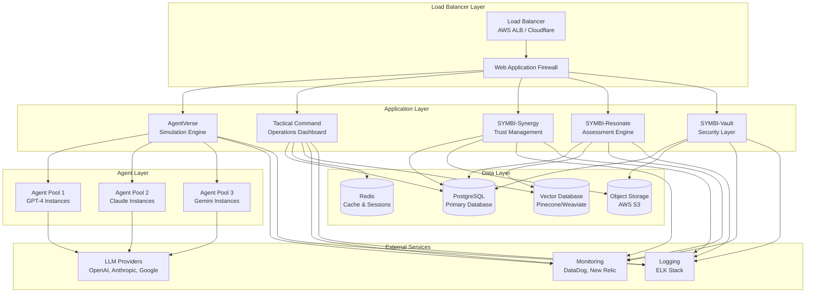

# SYMBI Ecosystem Deployment Strategy

## Executive Summary

This document outlines the comprehensive deployment strategy for the SYMBI ecosystem, covering infrastructure architecture, technology stack, deployment environments, security protocols, and operational procedures. The strategy ensures scalable, secure, and maintainable deployments across development, staging, and production environments.

## Table of Contents

1. [Infrastructure Architecture](#infrastructure-architecture)
2. [Technology Stack](#technology-stack)
3. [Deployment Environments](#deployment-environments)
4. [Security & Compliance](#security--compliance)
5. [Monitoring & Observability](#monitoring--observability)
6. [CI/CD Pipeline](#cicd-pipeline)
7. [Scaling Strategy](#scaling-strategy)
8. [Disaster Recovery](#disaster-recovery)
9. [Cost Optimization](#cost-optimization)
10. [Operational Procedures](#operational-procedures)

---

## Infrastructure Architecture

### High-Level Architecture



### Component Specifications

#### Load Balancer Layer
- **AWS Application Load Balancer (ALB)** or **Cloudflare Load Balancing**
- **SSL/TLS Termination** with automatic certificate management
- **Health Checks** with custom endpoints for each service
- **Geographic Routing** for global deployment optimization

#### Application Layer
- **Containerized Services** using Docker and Kubernetes
- **Microservices Architecture** with independent scaling
- **Service Mesh** (Istio) for inter-service communication
- **API Gateway** for unified external interface

---

## Technology Stack

### Frontend Technologies
- **Framework**: Next.js 15 with App Router
- **UI Library**: React 19 with TypeScript 5.x
- **Styling**: Tailwind CSS 4 with custom design system
- **State Management**: Zustand for client state, React Query for server state
- **Build Tools**: Turbopack for development, Webpack for production
- **Testing**: Jest, React Testing Library, Playwright for E2E

### Backend Technologies
- **Runtime**: Node.js 20+ with TypeScript
- **Framework**: Next.js API Routes with custom middleware
- **Database**: PostgreSQL 15+ with Prisma ORM
- **Cache**: Redis 7+ for session management and caching
- **Message Queue**: Redis Bull for background job processing
- **Authentication**: NextAuth.js with custom providers

### Agent Infrastructure
- **Containerization**: Docker with multi-stage builds
- **Orchestration**: Kubernetes with Helm charts
- **Service Mesh**: Istio for traffic management and security
- **Scaling**: Horizontal Pod Autoscaler (HPA) and Vertical Pod Autoscaler (VPA)
- **Networking**: Calico for network policies and security

### Data Storage
- **Primary Database**: PostgreSQL with read replicas
- **Vector Database**: Pinecone or Weaviate for embeddings
- **Object Storage**: AWS S3 or Google Cloud Storage
- **Backup**: Automated daily backups with point-in-time recovery

---

## Deployment Environments

### Development Environment

#### Configuration
```yaml
# development.yaml
environment: development
replicas: 1
resources:
  requests:
    cpu: 100m
    memory: 256Mi
  limits:
    cpu: 500m
    memory: 512Mi
database:
  host: localhost
  name: symbi_dev
  ssl: false
redis:
  host: localhost
  port: 6379
monitoring:
  enabled: false
```

#### Features
- **Hot Reload** for rapid development
- **Debug Mode** with detailed logging
- **Mock Services** for external dependencies
- **Local Database** with seed data
- **Development Tools** integrated

### Staging Environment

#### Configuration
```yaml
# staging.yaml
environment: staging
replicas: 2
resources:
  requests:
    cpu: 200m
    memory: 512Mi
  limits:
    cpu: 1000m
    memory: 1Gi
database:
  host: staging-db.internal
  name: symbi_staging
  ssl: true
redis:
  host: staging-redis.internal
  port: 6379
monitoring:
  enabled: true
  level: basic
```

#### Features
- **Production-like Environment** for testing
- **Automated Testing** with full test suite
- **Performance Testing** with load simulation
- **Security Scanning** with vulnerability assessment
- **Integration Testing** with external services

### Production Environment

#### Configuration
```yaml
# production.yaml
environment: production
replicas: 5
resources:
  requests:
    cpu: 500m
    memory: 1Gi
  limits:
    cpu: 2000m
    memory: 4Gi
database:
  host: prod-db-cluster.internal
  name: symbi_production
  ssl: true
  replicas: 3
redis:
  host: prod-redis-cluster.internal
  port: 6379
  cluster: true
monitoring:
  enabled: true
  level: comprehensive
```

#### Features
- **High Availability** with multi-zone deployment
- **Auto Scaling** based on metrics
- **Comprehensive Monitoring** with alerting
- **Security Hardening** with network policies
- **Backup and Recovery** procedures

---

## Security & Compliance

### Security Architecture

#### Network Security
```yaml
# Network Policies
apiVersion: networking.k8s.io/v1
kind: NetworkPolicy
metadata:
  name: symbi-network-policy
spec:
  podSelector:
    matchLabels:
      app: symbi
  policyTypes:
  - Ingress
  - Egress
  ingress:
  - from:
    - podSelector:
        matchLabels:
          role: frontend
    ports:
    - protocol: TCP
      port: 3000
  egress:
  - to:
    - podSelector:
        matchLabels:
          role: database
    ports:
    - protocol: TCP
      port: 5432
```

#### Authentication & Authorization
- **Multi-Factor Authentication** (MFA) required for admin access
- **Role-Based Access Control** (RBAC) with fine-grained permissions
- **API Key Management** with rotation and expiration
- **OAuth 2.0 / OpenID Connect** for external integrations
- **JWT Tokens** with short expiration and refresh mechanisms

#### Data Protection
- **Encryption at Rest**: AES-256 for database and storage
- **Encryption in Transit**: TLS 1.3 for all communications
- **Key Management**: AWS KMS or HashiCorp Vault
- **Data Classification**: Sensitive data identification and handling
- **Privacy Controls**: GDPR and CCPA compliance measures

### Compliance Framework

#### SOC 2 Type II
- **Security Controls** implementation and monitoring
- **Availability** guarantees with SLA commitments
- **Processing Integrity** with data validation
- **Confidentiality** with access controls
- **Privacy** with data handling procedures

#### Additional Compliance
- **GDPR**: Data protection and privacy rights
- **HIPAA**: Healthcare data security (if applicable)
- **ISO 27001**: Information security management
- **PCI DSS**: Payment card data security (if applicable)

---

## Monitoring & Observability

### Metrics Collection

#### Application Metrics
```typescript
// Prometheus metrics configuration
import { register, Counter, Histogram, Gauge } from 'prom-client';

export const httpRequestsTotal = new Counter({
  name: 'http_requests_total',
  help: 'Total number of HTTP requests',
  labelNames: ['method', 'route', 'status_code']
});

export const httpRequestDuration = new Histogram({
  name: 'http_request_duration_seconds',
  help: 'Duration of HTTP requests in seconds',
  labelNames: ['method', 'route'],
  buckets: [0.1, 0.5, 1, 2, 5]
});

export const activeConnections = new Gauge({
  name: 'websocket_connections_active',
  help: 'Number of active WebSocket connections'
});
```

#### Infrastructure Metrics
- **CPU and Memory Usage** per service and node
- **Network Traffic** and latency measurements
- **Database Performance** with query analysis
- **Storage Utilization** and I/O metrics
- **Container Health** and restart counts

### Logging Strategy

#### Structured Logging
```typescript
// Winston logger configuration
import winston from 'winston';

export const logger = winston.createLogger({
  level: process.env.LOG_LEVEL || 'info',
  format: winston.format.combine(
    winston.format.timestamp(),
    winston.format.errors({ stack: true }),
    winston.format.json()
  ),
  defaultMeta: {
    service: 'symbi-api',
    version: process.env.APP_VERSION,
    environment: process.env.NODE_ENV
  },
  transports: [
    new winston.transports.Console(),
    new winston.transports.File({ filename: 'error.log', level: 'error' }),
    new winston.transports.File({ filename: 'combined.log' })
  ]
});
```

#### Log Aggregation
- **ELK Stack** (Elasticsearch, Logstash, Kibana) for log processing
- **Fluentd** for log collection and forwarding
- **Log Retention** policies with automated cleanup
- **Search and Analytics** capabilities
- **Alert Integration** with monitoring systems

### Distributed Tracing

#### OpenTelemetry Integration
```typescript
// Tracing configuration
import { NodeSDK } from '@opentelemetry/sdk-node';
import { getNodeAutoInstrumentations } from '@opentelemetry/auto-instrumentations-node';
import { JaegerExporter } from '@opentelemetry/exporter-jaeger';

const sdk = new NodeSDK({
  traceExporter: new JaegerExporter({
    endpoint: process.env.JAEGER_ENDPOINT
  }),
  instrumentations: [getNodeAutoInstrumentations()]
});

sdk.start();
```

### Alerting Rules

#### Critical Alerts
```yaml
# Prometheus alerting rules
groups:
- name: symbi.rules
  rules:
  - alert: HighErrorRate
    expr: rate(http_requests_total{status_code=~"5.."}[5m]) > 0.1
    for: 5m
    labels:
      severity: critical
    annotations:
      summary: "High error rate detected"
      description: "Error rate is {{ $value }} errors per second"

  - alert: HighMemoryUsage
    expr: container_memory_usage_bytes / container_spec_memory_limit_bytes > 0.9
    for: 10m
    labels:
      severity: warning
    annotations:
      summary: "High memory usage"
      description: "Memory usage is above 90%"
```

---

## CI/CD Pipeline

### Pipeline Architecture

```mermaid
graph LR
    A[Code Commit] --> B[GitHub Actions]
    B --> C[Build & Test]
    C --> D[Security Scan]
    D --> E[Build Images]
    E --> F[Push to Registry]
    F --> G[Deploy to Staging]
    G --> H[Integration Tests]
    H --> I[Deploy to Production]
    I --> J[Health Checks]
    J --> K[Rollback if Failed]
```



### GitHub Actions Workflow

```yaml
# .github/workflows/deploy.yml
name: SYMBI Deployment Pipeline

on:
  push:
    branches: [main, develop]
  pull_request:
    branches: [main]

jobs:
  test:
    runs-on: ubuntu-latest
    strategy:
      matrix:
        node-version: [18, 20]
    steps:
      - uses: actions/checkout@v4
      - name: Setup Node.js
        uses: actions/setup-node@v4
        with:
          node-version: ${{ matrix.node-version }}
          cache: 'npm'
      
      - name: Install dependencies
        run: npm ci
      
      - name: Run linting
        run: npm run lint
      
      - name: Run type checking
        run: npm run type-check
      
      - name: Run unit tests
        run: npm run test:unit
      
      - name: Run integration tests
        run: npm run test:integration
      
      - name: Upload coverage reports
        uses: codecov/codecov-action@v3

  security:
    runs-on: ubuntu-latest
    needs: test
    steps:
      - uses: actions/checkout@v4
      
      - name: Run security audit
        run: npm audit --audit-level high
      
      - name: Run Snyk security scan
        uses: snyk/actions/node@master
        env:
          SNYK_TOKEN: ${{ secrets.SNYK_TOKEN }}

  build:
    runs-on: ubuntu-latest
    needs: [test, security]
    if: github.ref == 'refs/heads/main'
    steps:
      - uses: actions/checkout@v4
      
      - name: Set up Docker Buildx
        uses: docker/setup-buildx-action@v3
      
      - name: Login to Container Registry
        uses: docker/login-action@v3
        with:
          registry: ghcr.io
          username: ${{ github.actor }}
          password: ${{ secrets.GITHUB_TOKEN }}
      
      - name: Build and push Docker image
        uses: docker/build-push-action@v5
        with:
          context: .
          push: true
          tags: |
            ghcr.io/${{ github.repository }}:latest
            ghcr.io/${{ github.repository }}:${{ github.sha }}
          cache-from: type=gha
          cache-to: type=gha,mode=max

  deploy-staging:
    runs-on: ubuntu-latest
    needs: build
    environment: staging
    steps:
      - uses: actions/checkout@v4
      
      - name: Deploy to staging
        run: |
          kubectl set image deployment/symbi-api \
            symbi-api=ghcr.io/${{ github.repository }}:${{ github.sha }} \
            --namespace=staging
      
      - name: Wait for rollout
        run: |
          kubectl rollout status deployment/symbi-api \
            --namespace=staging --timeout=300s
      
      - name: Run smoke tests
        run: npm run test:smoke -- --env=staging

  deploy-production:
    runs-on: ubuntu-latest
    needs: deploy-staging
    environment: production
    if: github.ref == 'refs/heads/main'
    steps:
      - uses: actions/checkout@v4
      
      - name: Deploy to production
        run: |
          kubectl set image deployment/symbi-api \
            symbi-api=ghcr.io/${{ github.repository }}:${{ github.sha }} \
            --namespace=production
      
      - name: Wait for rollout
        run: |
          kubectl rollout status deployment/symbi-api \
            --namespace=production --timeout=600s
      
      - name: Run health checks
        run: npm run test:health -- --env=production
      
      - name: Notify deployment success
        uses: 8398a7/action-slack@v3
        with:
          status: success
          text: "🚀 SYMBI deployment successful!"
        env:
          SLACK_WEBHOOK_URL: ${{ secrets.SLACK_WEBHOOK }}
```

### Deployment Strategies

#### Blue-Green Deployment
```yaml
# Blue-Green deployment configuration
apiVersion: argoproj.io/v1alpha1
kind: Rollout
metadata:
  name: symbi-api
spec:
  replicas: 5
  strategy:
    blueGreen:
      activeService: symbi-api-active
      previewService: symbi-api-preview
      autoPromotionEnabled: false
      scaleDownDelaySeconds: 30
      prePromotionAnalysis:
        templates:
        - templateName: success-rate
        args:
        - name: service-name
          value: symbi-api-preview
      postPromotionAnalysis:
        templates:
        - templateName: success-rate
        args:
        - name: service-name
          value: symbi-api-active
```

#### Canary Deployment
```yaml
# Canary deployment configuration
apiVersion: argoproj.io/v1alpha1
kind: Rollout
metadata:
  name: symbi-api-canary
spec:
  replicas: 10
  strategy:
    canary:
      steps:
      - setWeight: 10
      - pause: {duration: 5m}
      - setWeight: 20
      - pause: {duration: 10m}
      - setWeight: 50
      - pause: {duration: 15m}
      - setWeight: 100
      analysis:
        templates:
        - templateName: error-rate
        - templateName: response-time
        args:
        - name: service-name
          value: symbi-api
```

---

## Scaling Strategy

### Horizontal Scaling

#### Auto Scaling Configuration
```yaml
# Horizontal Pod Autoscaler
apiVersion: autoscaling/v2
kind: HorizontalPodAutoscaler
metadata:
  name: symbi-api-hpa
spec:
  scaleTargetRef:
    apiVersion: apps/v1
    kind: Deployment
    name: symbi-api
  minReplicas: 3
  maxReplicas: 50
  metrics:
  - type: Resource
    resource:
      name: cpu
      target:
        type: Utilization
        averageUtilization: 70
  - type: Resource
    resource:
      name: memory
      target:
        type: Utilization
        averageUtilization: 80
  - type: Pods
    pods:
      metric:
        name: http_requests_per_second
      target:
        type: AverageValue
        averageValue: "100"
```

### Vertical Scaling

#### VPA Configuration
```yaml
# Vertical Pod Autoscaler
apiVersion: autoscaling.k8s.io/v1
kind: VerticalPodAutoscaler
metadata:
  name: symbi-api-vpa
spec:
  targetRef:
    apiVersion: apps/v1
    kind: Deployment
    name: symbi-api
  updatePolicy:
    updateMode: "Auto"
  resourcePolicy:
    containerPolicies:
    - containerName: symbi-api
      maxAllowed:
        cpu: 4
        memory: 8Gi
      minAllowed:
        cpu: 100m
        memory: 256Mi
```

### Database Scaling

#### Read Replicas
```yaml
# PostgreSQL read replica configuration
apiVersion: postgresql.cnpg.io/v1
kind: Cluster
metadata:
  name: symbi-postgres
spec:
  instances: 3
  primaryUpdateStrategy: unsupervised
  
  postgresql:
    parameters:
      max_connections: "200"
      shared_buffers: "256MB"
      effective_cache_size: "1GB"
      
  bootstrap:
    initdb:
      database: symbi
      owner: symbi_user
      
  storage:
    size: 100Gi
    storageClass: fast-ssd
    
  monitoring:
    enabled: true
```

---

## Disaster Recovery

### Backup Strategy

#### Database Backups
```bash
#!/bin/bash
# Automated backup script

# Full backup daily
pg_dump -h $DB_HOST -U $DB_USER -d symbi_production \
  --format=custom --compress=9 \
  --file="/backups/symbi_full_$(date +%Y%m%d).dump"

# Incremental backup every 6 hours
pg_dump -h $DB_HOST -U $DB_USER -d symbi_production \
  --format=custom --compress=9 \
  --incremental-base-id=$LAST_BACKUP_ID \
  --file="/backups/symbi_inc_$(date +%Y%m%d_%H%M).dump"

# Upload to S3
aws s3 sync /backups/ s3://symbi-backups/database/ \
  --storage-class GLACIER
```

#### Application State Backup
```yaml
# Velero backup configuration
apiVersion: velero.io/v1
kind: Backup
metadata:
  name: symbi-daily-backup
spec:
  includedNamespaces:
  - symbi-production
  excludedResources:
  - events
  - events.events.k8s.io
  storageLocation: aws-s3
  ttl: 720h0m0s  # 30 days
  schedule: "0 2 * * *"  # Daily at 2 AM
```

### Recovery Procedures

#### RTO/RPO Targets
- **Recovery Time Objective (RTO)**: 4 hours
- **Recovery Point Objective (RPO)**: 1 hour
- **Mean Time to Recovery (MTTR)**: 2 hours

#### Disaster Recovery Plan
1. **Incident Detection** (0-15 minutes)
   - Automated monitoring alerts
   - Manual incident reporting
   - Initial assessment and classification

2. **Response Team Activation** (15-30 minutes)
   - On-call engineer notification
   - Incident commander assignment
   - Communication channel setup

3. **Assessment and Triage** (30-60 minutes)
   - Impact analysis and scope determination
   - Root cause investigation
   - Recovery strategy selection

4. **Recovery Execution** (1-4 hours)
   - Backup restoration procedures
   - Service restoration and validation
   - Data integrity verification

5. **Post-Incident Review** (24-48 hours)
   - Incident timeline documentation
   - Root cause analysis
   - Process improvement recommendations

---

## Cost Optimization

### Resource Optimization

#### Compute Costs
```yaml
# Cost-optimized node groups
apiVersion: v1
kind: ConfigMap
metadata:
  name: cluster-autoscaler-status
data:
  nodes.max: "100"
  nodes.min: "3"
  scale-down-delay-after-add: "10m"
  scale-down-unneeded-time: "10m"
  skip-nodes-with-local-storage: "false"
  
# Spot instance configuration
nodeGroups:
  - name: spot-workers
    instanceTypes: ["m5.large", "m5.xlarge", "m4.large"]
    spot: true
    minSize: 0
    maxSize: 20
    desiredCapacity: 5
```

#### Storage Optimization
```yaml
# Intelligent tiering for S3
StorageClass:
  - Standard: Hot data (0-30 days)
  - IA: Warm data (30-90 days)
  - Glacier: Cold data (90+ days)
  - Deep Archive: Archive data (1+ years)

# Database storage optimization
postgresql:
  storage:
    class: gp3  # Cost-effective SSD
    iops: 3000  # Baseline performance
    throughput: 125  # MB/s
```

### Monitoring and Alerts

#### Cost Monitoring
```typescript
// Cost tracking metrics
export const costMetrics = {
  computeCosts: new Gauge({
    name: 'infrastructure_compute_cost_usd',
    help: 'Compute costs in USD per hour',
    labelNames: ['service', 'environment']
  }),
  
  storageCosts: new Gauge({
    name: 'infrastructure_storage_cost_usd',
    help: 'Storage costs in USD per month',
    labelNames: ['type', 'tier']
  }),
  
  networkCosts: new Gauge({
    name: 'infrastructure_network_cost_usd',
    help: 'Network costs in USD per GB',
    labelNames: ['direction', 'region']
  })
};
```

---

## Operational Procedures

### Deployment Checklist

#### Pre-Deployment
- [ ] Code review completed and approved
- [ ] All tests passing (unit, integration, E2E)
- [ ] Security scan completed with no critical issues
- [ ] Performance testing completed
- [ ] Database migrations tested
- [ ] Rollback plan prepared
- [ ] Monitoring and alerting configured
- [ ] Stakeholders notified

#### During Deployment
- [ ] Deployment initiated through CI/CD pipeline
- [ ] Health checks monitored
- [ ] Error rates and performance metrics tracked
- [ ] Database migration status verified
- [ ] Service dependencies confirmed healthy
- [ ] Load balancer configuration updated
- [ ] SSL certificates validated

#### Post-Deployment
- [ ] Smoke tests executed successfully
- [ ] Performance benchmarks met
- [ ] Error rates within acceptable limits
- [ ] User acceptance testing completed
- [ ] Documentation updated
- [ ] Deployment notes recorded
- [ ] Success notification sent
- [ ] Post-deployment monitoring activated

### Incident Response

#### Severity Levels
- **P0 (Critical)**: Complete service outage
- **P1 (High)**: Major functionality impaired
- **P2 (Medium)**: Minor functionality affected
- **P3 (Low)**: Cosmetic issues or enhancements

#### Response Times
- **P0**: 15 minutes
- **P1**: 1 hour
- **P2**: 4 hours
- **P3**: Next business day

### Maintenance Windows

#### Scheduled Maintenance
- **Weekly**: Security updates and patches
- **Monthly**: Minor version updates
- **Quarterly**: Major version upgrades
- **Annually**: Infrastructure refresh

#### Emergency Maintenance
- **Security vulnerabilities**: Immediate response
- **Critical bugs**: Within 24 hours
- **Performance issues**: Within 48 hours

---

## Conclusion

This deployment strategy provides a comprehensive framework for deploying and operating the SYMBI ecosystem at scale. The strategy emphasizes:

- **Reliability**: High availability and fault tolerance
- **Security**: Defense in depth with comprehensive controls
- **Scalability**: Horizontal and vertical scaling capabilities
- **Observability**: Complete monitoring and alerting
- **Efficiency**: Cost optimization and resource management
- **Maintainability**: Automated operations and clear procedures

Regular reviews and updates of this strategy ensure it remains aligned with evolving requirements and industry best practices.

---

*This document is maintained by the SYMBI DevOps team and updated quarterly or as needed for significant infrastructure changes.*